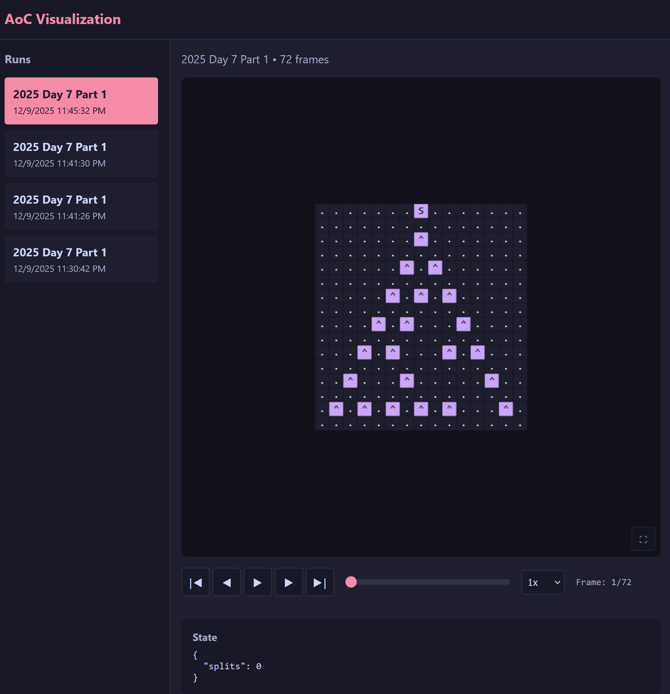

# aoc-vcr

Visualize your Advent of Code solvers in real-time.

Record state snapshots from your Python solver and watch them play back in a web UI with playback controls, speed adjustment, and live streaming.



## Example

Here is an example of how I've used `aoc-vcr` in a recent [Advent of Code solution](https://github.com/fredrik/advent-of-code/) for 2025 d07.

The code below yielded the gif demo above.

```
from aoc_vcr import Recorder

def solve(input):
    grid = parse_input(input)

   with Recorder(year=2025, day=7, part=1) as rec:
      splits = 0
      for r, row in enumerate(grid):
            for c, cell in enumerate(row):
               if cell == "S":
                  grid[r + 1][c] = "|"
               if cell == "." and grid[r - 1][c] == "|":
                  grid[r][c] = "|"
               if cell == "^" and grid[r - 1][c] == "|":
                  grid[r][c + 1] = "|"
                  grid[r][c - 1] = "|"
                  splits += 1

               rec.snapshot(grid=grid, splits=splits)

      return splits
```

All that's needed is to instantiate a `Recorder` with some metadata, and call `snapshot` whenever an interesting change has happened. `snapshot` performs diffing of the data structure (a grid in this case) so only a small amount of data is recorded to the backend for each iteration.


## Quick Start

1. Start the backend:
   ```bash
   cd backend && uv run uvicorn aoc_vcr_backend.main:app --reload
   ```

2. Open `frontend/index.html` in your browser

3. Install the client library:
   ```bash
   uv pip install -e path/to/library
   ```

4. Add recording to your solver:
   ```python
   from aoc_vcr import Recorder

   with Recorder(day=4, part=1) as rec:
       for step in solve(data):
           rec.snapshot(grid=grid, count=count)
   ```

5. Run your solver and watch the visualization update live

## Architecture

- **library/** - Python library for recording snapshots
- **backend/** - FastAPI server with SSE streaming
- **frontend/** - Vanilla JS web UI with canvas rendering

## Features

- Non-blocking recording (won't slow your solver)
- Live streaming via Server-Sent Events
- Playback controls with speed adjustment (0.5x - 10x)
- Keyboard shortcuts (Space, Arrow keys, Home/End)
- Grid and point visualization renderers
